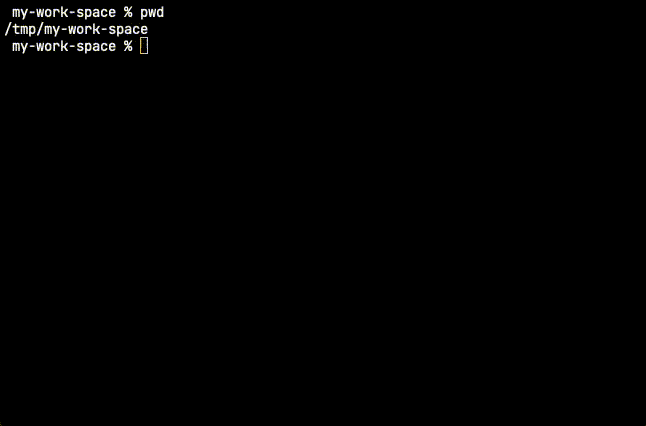

# Claude Code Container

[English](README.md) | [日本語](#日本語)

## 日本語

Dockerコンテナ内でClaude Codeを実行するためのツールです。

## セットアップ

1. **Container System を開始** (container runtimeを使用する場合)
   ```bash
   container system start
   ```

2. **すぐに使用可能**
   コンテナイメージは初回実行時に自動ビルドされます。手動ビルドは不要です！
   
   単に`claude-container`を実行するだけで、セットアップが自動的に完了します。

## 使用方法

```bash
claude-container [オプション] [ワークスペース] [-- claudeオプション...]
```

### オプション

- **--rebuild-container**: コンテナイメージを再ビルド
- **--remove-container**: コンテナイメージを削除

### 引数の詳細

- **workspace** (省略可能): 作業ディレクトリのパス
  - 省略時: カレントディレクトリを使用
  - `.`: カレントディレクトリを明示的に指定
  - `/path/to/project`: 特定のディレクトリを指定
- **--**: Claude オプションとの区切り文字
- **claude-options**: Claude Code に直接渡されるオプション

### 基本的な使用例

```bash
# カレントディレクトリを使用
claude-container

# カレントディレクトリを明示的に指定
claude-container .

# 特定のディレクトリを指定
claude-container /path/to/project
```

### Claudeオプション付きの使用例

```bash
# カレントディレクトリ + Claudeオプション
claude-container -- --model claude-3-opus-20240229

# カレントディレクトリを明示 + Claudeオプション
claude-container . -- --verbose

# 特定のディレクトリ + Claudeオプション
claude-container /path/to/project -- --model claude-3-opus

# Claudeのヘルプを表示
claude-container --help

# 危険な権限をスキップ
claude-container -- --dangerously-skip-permissions
```

### コンテナ管理の例

```bash
# コンテナイメージを再ビルド
claude-container --rebuild-container

# コンテナイメージを削除
claude-container --remove-container
```

### シンボリックリンクでの利用

スクリプトはシンボリックリンクに対応しており、どこからでも実行できます：

```bash
# PATHの通ったディレクトリにシンボリックリンクを作成
sudo ln -s /opt/ai-agents/claude-code-container/bin/claude-container /usr/local/bin/claude-container

# どこからでも実行可能
cd ~/my-project
claude-container

# または別の場所から
claude-container ~/my-project
```

**注意**: シンボリックリンクを使用しても、設定ファイル（`.claude`など）はプロジェクトルートの`docker/`フォルダから自動的に読み込まれます。

### プロジェクト構造

```
claude-code-container/
├── bin/
│   └── claude-container    # メイン実行スクリプト
├── docker/                 # 設定ファイル（自動作成）
│   ├── .claude/           # Claude設定
│   ├── .claude.json       # Claude設定ファイル
│   ├── .gitconfig         # Git設定（オプション）
│   ├── .npmrc             # npm設定（オプション）
│   └── ...                # その他のホームディレクトリファイル
├── Dockerfile             # コンテナイメージ定義
└── README.md              # ドキュメント
```

### dockerディレクトリについて

`docker/`ディレクトリは、コンテナ内のホームディレクトリ（`/home/node`）としてマウントされます。これにより以下のことが可能です：

- **永続的なGit設定**: `.gitconfig`ファイルを配置してgit設定を維持
- **SSHキー**: `.ssh/`ディレクトリを保存してgit認証に使用
- **NPM設定**: `.npmrc`でnpmレジストリ設定を追加
- **シェル設定**: `.bashrc`、`.zshrc`でパーソナライズされたシェル環境を構築
- **ツール設定**: 各種開発ツールの設定ファイルを保存

**追加可能な設定例:**

```bash
# Git認証情報と設定
docker/.gitconfig
docker/.ssh/id_rsa
docker/.ssh/id_rsa.pub
docker/.ssh/config

# 開発ツール設定
docker/.npmrc
docker/.zshrc
docker/.bashrc
docker/.vimrc

# アプリケーション固有の設定
docker/.aws/credentials
docker/.docker/config.json
```

`docker/`ディレクトリに配置されたすべてのファイルは、コンテナ内で利用可能で、実行間で永続化されます。

**実用的な使用例:**

```bash
# git認証情報を設定
echo '[user]
    name = Your Name
    email = your.email@example.com' > docker/.gitconfig

# git認証用のSSHキーをコピー
cp ~/.ssh/id_rsa docker/.ssh/
cp ~/.ssh/id_rsa.pub docker/.ssh/
chmod 600 docker/.ssh/id_rsa

# プライベートレジストリ用のnpm設定
echo 'registry=https://your-private-registry.com/' > docker/.npmrc

# カスタムシェルエイリアスを追加
echo 'alias ll="ls -la"
alias g="git"' >> docker/.zshrc
```

これにより、コンテナ環境をローカル開発環境のように使いやすくできます！

## デモ



*Claude Code Container の動作を示すアニメーション*

## 機能

- **ゼロマニュアルセットアップ**: 初回実行時にコンテナイメージを自動ビルド
- **自動設定**: ローカルのClaude設定（`.claude`ディレクトリ）を自動マウント
- **タイムゾーン検出**: ローカル環境のタイムゾーンを自動検出（Windows/macOS/Linux対応）
- **シンボリックリンク対応**: スクリプトをどこに配置・リンクしても動作
- **設定永続化**: コンテナ内での設定変更がローカルに保存
- **多言語対応**: 日本語環境では日本語、それ以外では英語で表示
- **柔軟な引数処理**: ワークスペース省略可能、`--`区切りでClaudeオプション指定
- **コンテナランタイム検出**: macOSでは`container`コマンド（利用可能な場合）、その他では`docker`を自動使用
- **コンテナ管理**: 必要に応じてコンテナイメージの再ビルドや削除が可能

## コンテナランタイム

スクリプトは適切なコンテナランタイムを自動検出して使用します：

- **macOS**: `container`コマンドが利用可能な場合はそれを使用、そうでなければ`docker`にフォールバック
- **その他のプラットフォーム**: `docker`コマンドを使用

`CONTAINER_RUNTIME`環境変数を設定することで、コンテナランタイムを上書きできます：

```bash
# dockerの使用を強制
CONTAINER_RUNTIME=docker claude-container

# containerの使用を強制（macOS）
CONTAINER_RUNTIME=container claude-container
```

## 参考

セットアップの詳細については以下を参照してください：
https://zenn.dev/schroneko/articles/claude-code-on-apple-container
